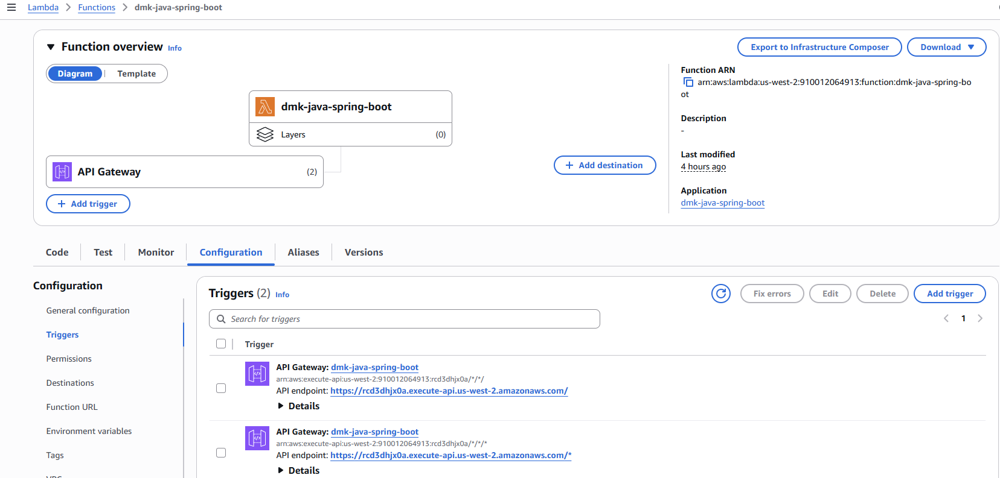

# Deployment Notes

## Strategy

I chose `aws-serverless-java-container-springboot3`, the README's canonical Java strategy.

- `Application.java` remains Lambda-unaware.
- `HelloController.java` remains Lambda-unaware.
- `StreamLambdaHandler` is the only Lambda-specific Java entrypoint.
- `maven-shade-plugin` creates a flat Lambda-loadable JAR instead of Spring Boot's nested JAR layout.
- The SAM template keeps the required HTTP API access method and points the Lambda handler at the stream handler class.

## Smoke Test


- API URL: `https://rcd3dhjx0a.execute-api.us-west-2.amazonaws.com/`
- `GET /`: passed
- `GET /api/hello/Lan`: passed
- `POST /api/echo`: passed

## Cold Start

Measured from CloudWatch `REPORT` lines using:

```bash
sam logs --stack-name dmk-java-spring-boot --region us-west-2 -t
```

Observed cold starts:

| Route | Duration | Billed Duration | Memory Size | Max Memory Used | Init Duration |
|---|---:|---:|---:|---:|---:|
| `GET /` | `173.59 ms` | `3136 ms` | `1024 MB` | `183 MB` | `2962.16 ms` |
| `POST /api/echo` | `213.49 ms` | `3717 ms` | `1024 MB` | `183 MB` | `3502.70 ms` |
| `GET /api/hello/Lan` | `196.09 ms` | `3755 ms` | `1024 MB` | `183 MB` | `3558.83 ms` |

Representative cold start value for worksheet: `3558.83 ms` (`~3.6 seconds`).
